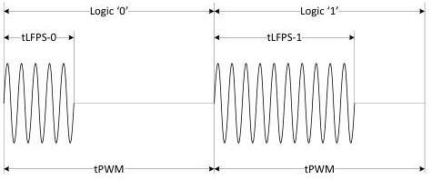

Physical Layer

### 6.9.5 SuperSpeedPlus LFPS Based PWM Message (LBPM)

LBPM is defined as a low power signaling mechanism for two SuperSpeedPlus ports to communicate with each other based on LFPS signals. The adoption of Pulse Width Modulation (PWM) is to embed the transmitting clock in data and to allow for easy data recovery at the receiver based on LFPS clock defined in Table 6-28. This section describes the concept and construction of LBPM. Refer to Chapter 7 for use of LBPM.

#### 6.9.5.1 Introduction to LFPS Based PWM Signaling (LBPS)

LBPS is based on PWM with embedded transmit clock and is basically constructed with two distinctive electrical states, which are LFPS signaling state and EI state. As is shown in Figure 6-34, two logic states are defined based on LBPS.

- Logic '0' is defined within the unit interval of tPWM as one-third of LFPS signal followed by two-third of EI.
- Logic '1' is defined within the unit interval of tPWM as two-third of LFPS signal followed by one-third of EI.

The specification of the transmit and receive LBPS is defined in Table 6-32.

Figure 6-34. Logic Representation of LBPS

Table 6-32. LBPS Transmit and Receive Specification

[tbl-86.md](tbl-86.md)

6-51