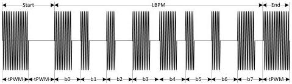
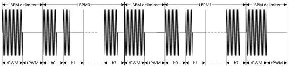

Universal Serial Bus 3.1 Specification, Revision 1.0

### 6.9.5.2 LBPM Definition and Transmission

LBPM is byte based with LSb transmitted first. A port may transmit a single LBPM, or consecutive LBPMs. The transmission of LBPM shall adhere to the following conventions.

- A LBPM delimiter is defined with one tPWM of LFPS followed by one tPWM of EI.
- The LPBM transmission shall start with a LBPM delimiter.
- The LBPM transmission shall end with a LBPM delimiter.
- The transmission of LBPM shall be LSb first.
- Consecutive LBPM transmission shall be LSB first with LBPM delimiter in between each LBPMs.

Examples of LBPM transmission are shown in Figure 6-35.

(a). Single LBPM Transmission

(b). Consecutive LBPMs Transmitted Back to Back

Figure 6-35. LBPM Transmission Examples

6-52