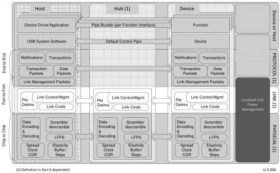

# 7 Link Layer

The Enhanced SuperSpeed USB consists of SuperSpeed USB operating at the Gen 1 speed, and SuperSpeedPlus USB operating at the Gen 2 speed. The link layer of the Enhanced SuperSpeed USB has the responsibility of maintaining the link connectivity so that successful data transfers between the two link partners are ensured. A robust link flow control is defined based on packets and link commands. Packets are prepared in the link layer to carry data and different information between the host and a device. Link commands are defined for communications between the two link partners. Packet frame ordered sets and link command ordered sets are also constructed such that they are tolerant to one symbol error. In addition, error detection capabilities are also incorporated into a packet and a link command to verify packet and link command integrity.

Figure 7-1. Link Layer

The link layer also facilitates link training, link testing/debugging, and link power management. This is accomplished by the introduction of Link Training Status State Machine (LTSSM).

The focus of this chapter is to address the following in detail:

- Packet Framing
- Link command definition and usage
- Link initialization and flow control
- Link power management
- Link error rules/recovery
- Resets
- LTSSM specifications

7-1