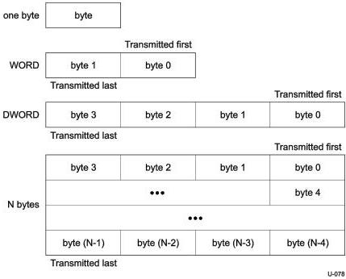

Universal Serial Bus 3.1 Specification

## 7.1 Byte Ordering

Multiple byte fields in a packet or a link command are moved over to the bus in little-endian order, i.e., the least significant byte (LSB) first, and the most significant byte (MSB) last. Figure 7-2 shows an example of byte ordering.

Figure 7-2. Byte Ordering

### 7.1.1 SuperSpeed USB Line Code

Each byte of a packet or link command will be encoded in the physical layer using 8b/10b encoding. Refer to Section 6.3.1.3 regarding 8b/10b encoding and bit ordering.

### 7.1.2 SuperSpeedPlus USB Line Code

To improve the effective throughput for SuperSpeedPlus USB, 128b/132b line code is employed to replace 8b/10b line code used in SuperSpeed USB. Two block types are defined based on 128b/132b line code. A control block is defined to transmit TSEQ, TS1, TS2, SYNC, SDS, and SKP ordered sets. A data block is defined to transmit packets, link commands, and Idle Symbols. Refer to Section 6.3 for 128b/132b block definition and bit ordering. Each symbol within a data block is scrambled by default, unless disabled otherwise by the Disabling Scrambling bit asserted in the TS2 ordered set received in Polling.Configuration or Recovery.Configuration. Refer to Sections 7.5.4.9 and 7.5.10.4 for details.

7-2