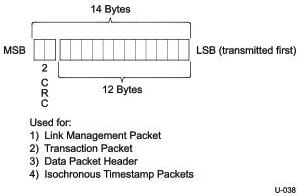

Link Layer

### 7.2.1.1.2 Packet Header

A packet header consists of 14 bytes as formatted in Figure 7-5. It includes 12 bytes of header information and a 2-byte CRC-16. CRC-16 is used to protect the data integrity of the 12-byte header information.

Figure 7-5. Packet Header

The implementation of CRC-16 on the packet header is defined below:

- The polynomial for CRC-16 shall be 100Bh.
Note: The CRC-16 polynomial is not the same as the one used for USB 2.0.
- The initial value of CRC-16 shall be FFFFh.
- CRC-16 shall be calculated for all 12 bytes of the header information, not inclusive of any packet framing symbols.
- CRC-16 calculation shall begin at byte 0, bit 0 and continue to bit 7 of each of the 12 bytes.
- The remainder of CRC-16 shall be complemented.
- The residual of CRC-16 shall be F6AAh.

Note: The inversion of the CRC-16 remainder adds an offset of FFFFh that will create a constant CRC-16 residual of F6AAh at the receiver side.

Figure 7-6 is an illustration of CRC-16 remainder generation. The output bit ordering is listed in Table 7-1.

7-5