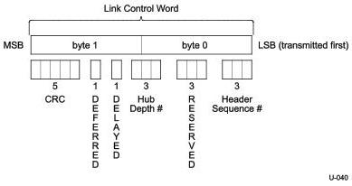

Link Layer

### 7.2.1.1.3 Link Control Word

The 2-byte Link Control Word is formatted as shown in Figure 7-7. It is used for both link level and end-to-end flow control.

The Link Control Word shall contain a 3-bit Header Sequence Number, 3-bit Reserved, a 3-bit Hub Depth Index, a Delayed bit (DL), a Deferred bit (DF), and a 5-bit CRC-5.

Figure 7-7. Link Control Word

CRC-5 protects the data integrity of the Link Control Word. The implementation of CRC-5 is defined below:

- The CRC-5 polynomial shall be 00101b.
- The Initial value for the CRC-5 shall be 11111b.
- CRC-5 is calculated for the remaining 11 bits of the Link Control Word.
- CRC-5 calculation shall begin at bit 0 and proceed to bit 10.
- The remainder of CRC-5 shall be complemented, with the MSb mapped to bit 11, the next MSb mapped to bit 12, and so on, until the LSb mapped to bit 15 of the Link Control Word.
- The residual of CRC-5 shall be 01100b.

Note: The inversion of the CRC-5 remainder adds an offset of 11111b that will create a constant CRC-5 residual of 01100b at the receiver side.

Figure 7-8 is an illustration of CRC-5 remainder generation.

7-7