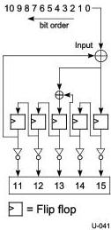
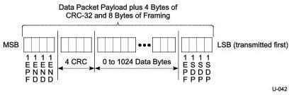

Universal Serial Bus 3.1 Specification

Figure 7-8. CRC-5 Remainder Generation

### 7.2.1.2 Data Packet Payload Structure

Data packets are a special type of packet consisting of a Data Packet Header (DPH) and a Data Packet Payload (DPP). The DPH is defined in Section 7.2.1.1. The DPP, on the other hand, consists of a data packet payload framing, and a variable length of data followed by 4 bytes of CRC-32. Figure 7-9 describes the format of a DPP.

#### 7.2.1.2.1 Data Packet Payload Framing

DPP framing ordered sets consist of a starting framing ordered set called DPPSTART OS, and one of two ending framing ordered sets called DPPEND OS or DPPABORT OS. As indicated by Figure 7-9, a DPPSTART ordered set, which is a DPP starting frame ordered set, consists of three consecutive symbols of SDP followed by a single symbol of EPF. A DPP ending frame ordered set has two different types. The first type, DPPEND ordered set, is a DPP ending frame ordered set which consists of three consecutive symbol of END followed by a single symbol of EPF. The second type, DPPABORT ordered set, is a DPP aborting frame ordered set which consists of three consecutive symbol of EDB (end of nullified packet) followed by a single symbol of EPF. The DPPEND ordered set is used to indicate a normal ending of a complete DPP. For SuperSpeed USB, the DPPABORT ordered set is used to indicate an abnormal ending of a DPP. For SuperSpeedPlus USB, a DPPABORT OS is used to notify either a partially nullified DPP or nullified DPP.

Figure 7-9. Data Packet Payload with CRC-32 and Framing

7-8