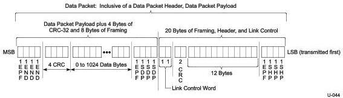
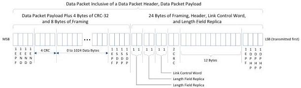

Link Layer

- In the case of partially nullified DPP, it shall append DPPABORT OS after completing the DPP as defined by the length field in its associated DPH, similar to normal ending of DPP. A port shall fill with Idle Symbols in DPP if intended data for transmission are not available. The condition to transmit a partially nullified DPP is implementation specific.

### 7.2.1.2.3 Data Payload Structure and Spacing between DPH and DPP

There shall be no spacing between a DPH and its corresponding DPP. This is illustrated in Figure 7-11.

(a). SuperSpeed DP Format

(b). SuperSpeedPlus DP Format

Figure 7-11. Data Packet with Data Packet Header Followed by Data Packet Payload. (a) SuperSpeed DP; (b). SuperSpeedPlus DP

Additional details on how header packets are transmitted and received at the link level are described in Section 7.2.4.

7-11