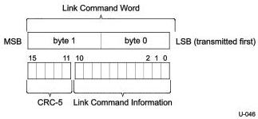

Link Layer

### 7.2.2.2 Link Command Word Definition

Link command word is 16 bits long with the 11-bit link command information protected by a 5-bit CRC-5 (see Figure 7-13). The 11-bit link command information is defined in Table 7-4. The calculation of CRC-5 is the same as Link Control Word illustrated in Figure 7-7.

Figure 7-13. Link Command Word Structure

7-13