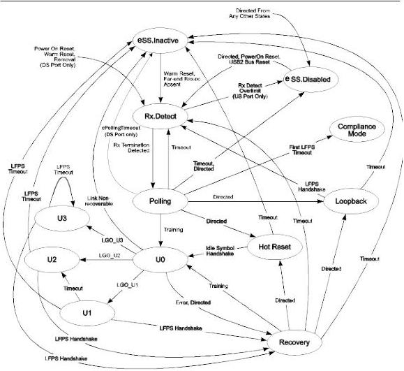

Universal Serial Bus 3.1 Specification

Note: Transition conditions are illustrative only. Not all of the transition conditions are listed.

U-047A

Figure 7-14. State Diagram of the Link Training and Status State Machine

7-48