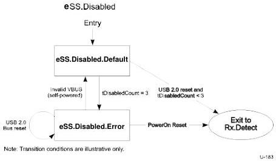

Universal Serial Bus 3.1 Specification

### 7.5.1.2.2 eSS.Disabled Requirements

The requirements of a peripheral upstream port are the same as defined in Section 7.5.1.1.1. In addition, a peripheral upstream port shall implement a tDisabledCount counter. The operation of the tDisabledCount counter shall meet the following requirement.

- The tDisabledCount counter shall be reset to zero upon one of the following two conditions:

1. Invalid VBUS
2. Successful port configuration exchange

- The tDisabledCount counter shall be incremented upon entry to eSS.Disabled.Default.

### 7.5.1.2.3 Exit from eSS.Disabled.Default

- A peripheral upstream port shall transition to Rx.Detect if one of the following conditions are met:

1. When VBUS transitions to valid.
2. When a USB 2.0 bus reset is detected and tDisabledCount is less than 3.

- A peripheral upstream port shall transition to eSS.Disabled.Error if tDisabledCount is 3.

### 7.5.1.2.4 Exit from eSS.Disabled.Error

- A peripheral upstream port shall transition to Rx.Detect upon PowerOn reset.
- A self-powered peripheral upstream port shall transition to eSS.Disabled.Default upon detection of invalid VBUS.
- A peripheral upstream port shall remain in eSS.Disabled.Error upon detection of USB 2.0 bus reset.

Figure 7-15. eSS.Disabled Substate Machine

7-50