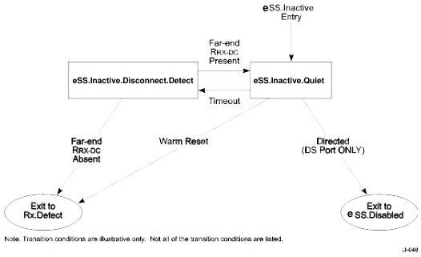

Universal Serial Bus 3.1 Specification

- The port shall transition to eSS.Inactive.Quiet when a far-end low-impedance receiver termination (R_RX-DC) meeting specification defined in Table 6-21 is detected.

Figure 7-16. eSS.Inactive Substate Machine

### 7.5.3 Rx.Detect

Rx.Detect is the power on state of the LTSSM for both a downstream port and an upstream port. It is also the state for a downstream port upon issuing a Warm Reset, and the state for an upstream port upon detecting a Warm Reset from any other link state except eSS.Disabled. The purpose of Rx.Detect is to detect the impedance of far-end receiver termination to ground. Rx.Detect.Reset is a default reset state used by the two ports to synchronize the operation after a Warm Reset; this substate exits immediately if Warm Reset is not present. Rx.Detect.Active is a substate for far-end receiver termination detection. Rx.Detect.Quiet is a power saving substate in which the function of a far-end receiver termination detection is disabled. A port will perform the far-end receiver termination detection periodically during Rx.Detect.

#### 7.5.3.1 Rx.Detect Substate Machines

Rx.Detect contains a substate machine shown in Figure 7-17 with the following substates:

- Rx.Detect.Reset
- Rx.Detect.Active
- Rx.Detect.Quiet

#### 7.5.3.2 Rx.Detect Requirements

- The transmitter common mode is not required to be within specification during this state.
- The low-impedance receiver termination (R_RX-DC) defined in Table 6-21 shall be maintained.

7-52