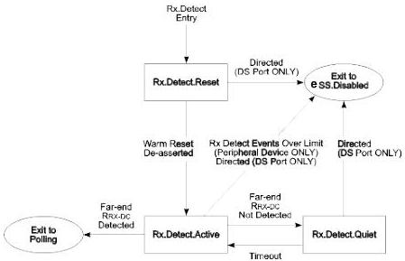

Link Layer

Note: Transition conditions are illustrative only. Not all of the transition conditions are listed.

U-049

Figure 7-17. Rx.Detect Substate Machine

### 7.5.4 Polling

Polling is a state for port capability negotiation and link training. During Polling, a Polling.LFPS handshake shall take place between the two ports in SuperSpeed operation before the link training is started. Similarly for SuperSpeedPlus operation, Polling.LFPS based SCD1/SCD2 handshakes, LBPM based port capability negotiation and match, and subsequent port configuration shall take place before SuperSpeedPlus link training is started. Bit lock, block alignment for SuperSpeedPlus operation, symbol lock, lane polarity inversion, and Rx equalization trainings are achieved using TSEQ, SYNC, TS1, and TS2 training ordered sets.

#### 7.5.4.1 Polling Substate Machines

Polling contains a substate machine shown in Figure 7-18 with the following substates:

- Polling.LFPS
- Polling.LFPSPlus
- Polling.PortMatch
- Polling.PortConfig
- Polling.RxEQ
- Polling.Active
- Polling.Configuration
- Polling.Idle

#### 7.5.4.2 Polling Requirements

- The port shall maintain its low-impedance receiver termination (R_RX-DC) defined in Table 6-21.

7-55