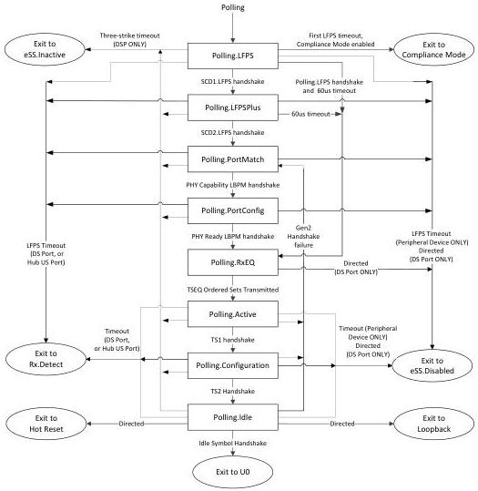

Link Layer

Note: Transition conditions are illustrative only. Not all of the transition conditions are listed.

Figure 7-18. Polling Substate Machine

### 7.5.5 Compliance Mode

Compliance Mode is used to test the transmitter for compliance to voltage and timing specifications. Several different test patterns are transmitted as defined in Table 6-13. Compliance Mode does not contain any substate machines.

Note that for a downstream port, the default setting for entry to Compliance Mode is disabled. It may optionally be enabled when directed. This is to prevent the automatic entry to Compliance Mode due to connection of a bad device that fails to exit from Polling.LFPS upon power-on, or a downstream port fails to respond in time.

#### 7.5.5.1 Compliance Mode Requirements

- The port shall maintain its low-impedance receiver termination (R_RX-DC) defined in Table 6-21.

7-67