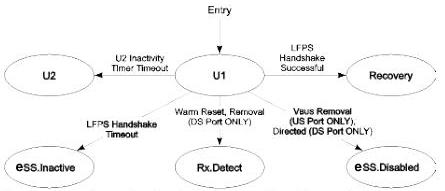

Link Layer

Note: Transition conditions are illustrative only. Not all of the transition conditions are listed.

U-051

Figure 7-19. U1

### 7.5.8 U2

U2 is a link state where more power saving opportunities are allowed compare to U1, but with an increased exit latency.

U2 does not contain any substates. The transitions to other states are shown in Figure 7-20.

#### 7.5.8.1 U2 Requirements

- The Enhanced SuperSpeed transmitter DC common mode voltage does not need to be within specification (VTX-CM-DC-ACTIVE-IDLE-DELTA) defined in Table 6-18.
- The port shall maintain its low-impedance receiver termination (RRX-DC) defined in Table 6-21.
- When a downstream port is in U2, its upstream port may be in U1 or U2. If the upstream port is in U1, it will send Ping.LFPS periodically. A downstream port shall differentiate between Ping.LFPS and U1 LFPS exit handshake signaling.
- The port shall enable its U2 exit detect functionality as defined in Section 6.9.2.
- The port shall enable its LFPS transmitter when it initiates the exit from U2.
- A downstream port shall perform a far-end receiver termination detection every 100 ms (tU2RxdetDelay).

#### 7.5.8.2 Exit from U2

- A downstream port shall transition to eSS.Disabled when directed.
- A downstream port shall transition to Rx.Detect upon detection of a far-end high-impedance receiver termination (ZRX-HIGH-IMP-DC-POS) defined in Table 6-21.
- A downstream port shall transition to Rx.Detect when directed to issue Warm Reset.
- An upstream port shall transition to Rx.Detect when Warm Reset is detected.
- A self-powered upstream port shall transition to eSS.Disabled upon not detecting valid Vbus as defined in Section 11.4.5.
- The port shall transition to Recovery upon successful completion of a LFPS handshake meeting the U2 LFPS exit signaling defined in Section 6.9.2.

7-71