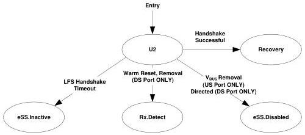

Universal Serial Bus 3.1 Specification

- The port shall transition to eSS.Inactive upon the 2-ms LFPS handshake timer timeout (tNoLFPSResponseTimeout) and a successful LFPS handshake meeting the U2 LFPS exit handshake signaling in Section 6.9.2 is not achieved.

Note: Transition conditions are illustrative only, Not all of the transition conditions are listed.

Figure 7-20. U2

### 7.5.9 U3

U3 is a link state where a device is put into a suspend state. Significant link and device powers are saved.

U3 does not contain any substates. Transitions to other states are shown in Figure 7-21.

### 7.5.9.1 U3 Requirements

- The Enhanced SuperSpeed transmitter DC common mode voltage does not need to be within specification (VTX-CM-DC-ACTIVE-IDLE-DELTA) defined in Table 6-18.
- The port shall maintain its low-impedance receiver termination (RRX-DC) defined in Table 6-21.
- LFPS Ping detection shall be disabled.
- The port shall enable its U3 wakeup detect functionality as defined in Section 6.9.2.
- The port shall enable its LFPS transmitter when it initiates the exit from U3.
- A downstream port shall perform a far-end receiver termination detection every 100 ms (tU3RxdetDelay).
- The port not able to respond to U3 LFPS wakeup within tNoLFPSResponseTimeout may initiate U3 LFPS wakeup when it is ready to return to U0.

### 7.5.9.2 Exit from U3

- A downstream port shall transition to eSS.Disabled when directed.
- A downstream port shall transition to Rx.Detect upon detection of a far-end high-impedance receiver termination ($Z_{RX-HIGH-IMP-DC-POS}$) defined in Table 6-21.
- A downstream port shall transition to Rx.Detect when directed to issue Warm Reset.
- An upstream port shall transition to Rx.Detect when Warm Reset is detected.

7-72