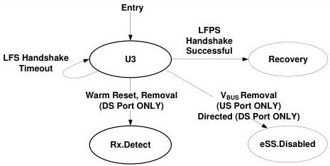

Link Layer

- A self-powered upstream port shall transition to eSS.Disabled upon not detecting valid Vbus as defined in Section 11.4.5.
- The port shall transition to Recovery upon successful completion of a LFPS handshake meeting the U3 wakeup signaling defined in Section 6.9.2.
- The port shall remain in U3 when the 10-ms LFPS handshake timer times out (tNoLFPSResponseTimeout) and a successful LFPS handshake meeting the U3 wakeup handshake signaling in Section 6.9.2 is not achieved. 100 ms (tU3WakeupRetryDelay) after an unsuccessful LFPS handshake and the requirement to exit U3 still exists, then the port shall initiate the U3 wakeup LFPS Handshake signaling to wake up the host.

Note: Transition conditions are illustrative only, Not all of the transition conditions are listed.

Figure 7-21. U3

### 7.5.10 Recovery

The Recovery link state is entered to retrain the link, or to perform Hot Reset, or to switch to Loopback mode. In order to retrain the link and also minimize the recovery latency, the two link partners do not train the receiver equalizers. Instead, the last trained equalizer configurations are maintained. Only TS1 and TS2 ordered sets are transmitted to synchronize the link and to exchange the link configuration information defined in Table 6-5.

#### 7.5.10.1 Recovery Substate Machines

Recovery contains a substate machine shown in Figure 7-22 with the following substates:

- Recovery.Active
- Recovery.Configuration
- Recovery.Idle

#### 7.5.10.2 Recovery Requirements

- The port shall meet the transmitter specifications as defined in Table 6-17.
- The port shall maintain the low-impedance receiver termination (RRX-DC) as defined in Table 6-21.

7-73