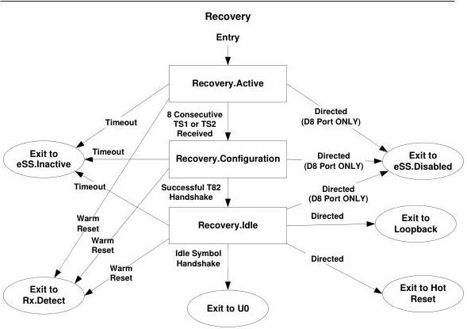

Link Layer

Note: Transition conditions are illustrative only. Not all transition conditions are listed.

Figure 7-22. Recovery Substate Machine

### 7.5.11 Loopback

Loopback is intended for test and fault isolation. Loopback includes a bit error rate test (BERT) state machine, described in Chapter 6.

A loopback master is the port requesting loopback. A loopback slave is the port that retransmits the symbols received from the loopback master.

During Loopback.Active, the loopback slave must support the BERT protocol described in Chapter 6. The loopback slave must respond to the command for BERT error counter reset and BERT report error count. The loopback slave must check the incoming data for the loopback data pattern.

#### 7.5.11.1 Loopback Substate Machines

Loopback contains a substate machine shown in Figure 7-23 with the following substates:

- Loopback.Active
- Loopback.Exit

7-77