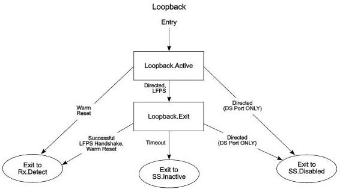

Link Layer

- An upstream port shall transition to Rx.Detect when Warm Reset is detected.

Note: Transition conditions are illustrative only. Not all of the transition conditions are listed.

U-055

Figure 7-23. Loopback Substate Machine

### 7.5.12 Hot Reset

Only a downstream port can be directed to initiate a Hot Reset.

When the downstream port initiates reset, it shall transmit TS2 ordered sets with the Reset bit asserted. The upstream port shall respond by sending the TS2 ordered sets with Reset bit asserted. Upon completion of Hot Reset processing, the upstream port shall signal the downstream port by sending the TS2 ordered sets with the Reset bit de-asserted. The downstream port shall respond with the Reset bit de-asserted in the TS2 ordered sets. Once both ports receive the TS2 ordered sets with the Reset bit de-asserted, they shall exit from Hot Reset.Active and transition to Hot Reset.Exit. Once a successful idle symbol handshake is achieved, the port shall return to U0.

#### 7.5.12.1 Hot Reset Substate Machines

Hot Reset contains a substate machine shown in Figure 7-24 with the following substates:

- Hot Reset Active
- Hot Reset.Exit

#### 7.5.12.2 Hot Reset Requirements

- A downstream port shall reset its Link Error Count as defined in Section 7.4.2.
- A downstream port shall reset its PM timers and the associated U1 and U2 timeout values to zero.
- The port in SuperSpeedPlus operation shall reset the Soft Error Count if implemented.
- The port Configuration information shall remain unchanged (refer to Section 8.4.6 for details).

7-79