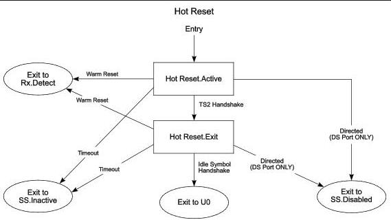

Link Layer

- The port in SuperSpeedPlus operation shall transmit a single SDS ordered set before the start of the data block with Idle Symbols.
- The port in SuperSpeedPlus operation may ignore SDS ordered set if corrupted and continue to process the following data block. The port may optionally choose to recover SDS ordered set if error is detected.
- A 2-ms timer (tHotResetExitTimeout) shall be started upon entry to this substate.
- The port shall be able to receive the Header Sequence Number Advertisement from its link partner.

Note: The exit time difference between the two ports will result in one port entering U0 first and starting the Header Sequence Number Advertisement while the other port is still in Hot Reset.Exit.

### 7.5.12.4.2 Exit from Hot Reset.Exit

- The port shall transition to U0 when the following two conditions are met:

1. Eight consecutive Idle Symbols are received.
2. Sixteen Idle Symbols are sent after receiving one Idle Symbol.

- The port shall transition to eSS.Inactive upon the 2-ms timer timeout (tHotResetExitTimeout) and the conditions to transition to U0 are not met.
- A downstream port shall transition to eSS.Disabled when directed.
- A downstream port shall transition to Rx.Detect when directed to issue Warm Reset.
- An upstream port shall transition to Rx.Detect when Warm Reset is detected.

Note: Transition conditions are illustrative only. Not all of the transition conditions are listed.

U-056

Figure 7-24. Hot Reset Substate Machine

7-81