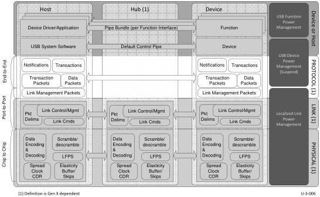

8

# Protocol Layer

The protocol layer manages the end-to-end flow of data between a device and its host. This layer is built on the assumption that the link layer guarantees delivery of header packets and this layer adds on end to end reliability for the rest of the packets depending on the transfer type.

Where not specifically noted, requirements apply to both the SuperSpeed and SuperSpeedPlus architectures. Gen 2 speed capable devices operating at Gen 1 speed, regardless of their additional capabilities (e.g. Gen 2 speed), shall only use features of the SuperSpeed architecture.

The chapter describes the following in detail:

- Types of packets
- Format of the packets
Expected responses to packets sent by the host and a device
- The four USB defined transfer types
- Support for Streams for the bulk transfer type
- Timing parameters for the various responses and packets the host or a device may receive or transmit

Figure 8-1. Protocol Layer Highlighted

8-1