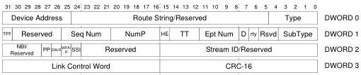

Universal Serial Bus 3.1 Specification, Revision 1.0

## 8.2 Packet Types

Enhanced SuperSpeed USB uses four basic packet types each with one or more subtypes. The four packet types are:

- Link Management Packets (LMP) only travel between a pair of links (e.g., a pair of directly connected ports) and is primarily used to manage that link.
- Transaction Packets (TP) traverse all the links directly connecting the host to a device. They are used to control the flow of data packets, configure devices, and hubs, etc. Transaction Packets have no data payload.
- Data Packets (DP) traverse all the links directly connecting the host to a device. Data Packets have two parts: a Data Packet Header (DPH) and a Data Packet Payload (DPP).
- Isochronous Timestamp Packets (ITP) are multicast on all the active links.

All packets consist of a 14-byte header, followed by a 2-byte Link Control Word at the end of the packet (16 bytes total). All headers have a Type field that is used by the receiving entity (e.g., host, hub, or device) to determine how to process the packet. All headers include a 2-byte CRC (CRC-16).

All devices (including hubs) and the host consume the LMPs they receive.

If the value of the Type field is Transaction Packet or Data Packet Header, the Route String and Device Address fields follow the Type field. The Route String field is used by hubs to route packets which appear on their upstream port to the appropriate downstream port. Packets flowing from a device to the host are always routed from a downstream port on a hub to its upstream port. The Device Address field is provided to the host so that it can identify the source of a packet. All other fields are discussed further in this chapter.

Figure 8-2. Example Transaction Packet

Data Packets include additional information in the header that describes the data block. The Data Block is always followed by a 4-byte CRC-32 used to determine the correctness of the data. The Data Block and the CRC-32 together are referred to as the Data Packet Payload.

8-4