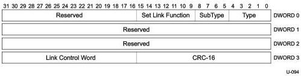

Universal Serial Bus 3.1 Specification, Revision 1.0

### 8.4.2 Set Link Function

The Set Link Function LMP shall be used to configure functionality that can be changed without leaving the active (U0) state.

Upon receipt of an LMP with the Force_LinkPM_Accept bit asserted, the port shall accept all LGO_U1 and LGO_U2 Link Commands until the port receives an LMP with the Force_LinkPM_Accept bit de-asserted. After port receives an LMP with the Force_LinkPM_Accept bit de-asserted, port will function in normal mode doing power management based on packet pending state of device's endpoints.

The device must stay in U1 or U2 until the downstream port initiates exit to U0. Software must ensure that there are no pending packets at the link level before issuing a SetPortFeature command that generates an LGO_U1 or LGO_U2 link command.

During normal operation, this feature shall only be used if all other means of lowering the link state from U0 to U1 or U2 fail.

This LMP is sent by a hub to a device connected on a specific port when it receives a SetPortFeature (FORCE_LINKPM_ACCEPT) command. Refer to Section 10.16.2.2 and Section 10.16.2.10 for more details.

Note: Improper use of the Force_LinkPM_Accept functionality can impact the performance of the link significantly and in some cases (when used during normal operation only) may lead to the device being unable to return to proper operation.

Figure 8-5. Set Link Function LMP

8-8