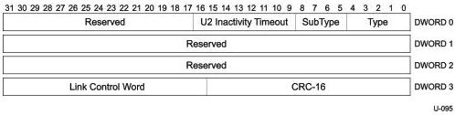

Protocol Layer

Table 8-4. Set Link Function

[tbl-107.md](tbl-107.md)

### 8.4.3 U2 Inactivity Timeout

The U2 Inactivity Timeout LMP shall be used to define the timeout from U1 to U2. Refer to Section 10.6 for details on this LMP.

Figure 8-6. U2 Inactivity Timeout LMP

Table 8-5. U2 Inactivity Timer Functionality

[tbl-108.md](tbl-108.md)

8-9