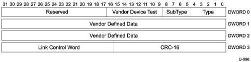

Universal Serial Bus 3.1 Specification, Revision 1.0

### 8.4.4 Vendor Device Test

Use of this LMP is intended for vendor-specific device testing and shall not be used during normal operation of the link.

Figure 8-7. Vendor Device Test LMP

Table 8-6. Vendor-specific Device Test Function

[tbl-109.md](tbl-109.md)

### 8.4.5 Port Capabilities

The Port Capability LMP describes each port's link capabilities and is sent by both link partners after the successful completion of training and link initialization. After the port enters U0 from Polling, the port shall send Port Capability LMP within tPortConfiguration time once link initialization (refer to Section 7.2.4.1.1) is completed. Note the port may not always transition directly from Polling to U0, but may transition through other intermediate states (e.g., Recovery or Hot Reset) before entering U0. Regardless of states passed through between Polling and entry into U0, the device shall send a Port Capability LMP immediately upon entering U0.

If a link partner does not receive this LMP within tPortConfiguration time then:

- If the link partner has downstream capability, it shall signal an error as described in Section 10.16.2.6.
- If the link partner only supports upstream capability, see Sections 10.5 and 10.18 which define the hub and peripheral upstream port connect states.

8-10