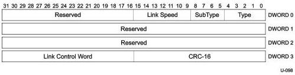

Universal Serial Bus 3.1 Specification, Revision 1.0

After exchanging Port Capability LMPs, the link partners shall determine which of the link partners shall be configured as the downstream facing port as specified in Table 8-8.

Table 8-8. Port Type Selection Matrix

[tbl-111.md](tbl-111.md)

Note: $^{1}$If the TieBreaker field contents are equal, then the two link partners shall exchange Port Capability LMPs again with new and different value in the TieBreaker field. The sequence of TieBreaker field values generated by a port shall be sufficiently random.

### 8.4.6 Port Configuration

Only the fields that are different from the Port Capability LMP are described in this section.

All Enhanced SuperSpeed ports that support downstream port capability shall be capable of sending this LMP.

If the port that was to be configured in the upstream facing mode does not receive this LMP within tPortConfiguration time after link initialization, then the upstream port shall transition to eSS.Disabled and a peripheral device shall try and connect at the other speeds this device supports.

Figure 8-9. Port Configuration LMP

8-12