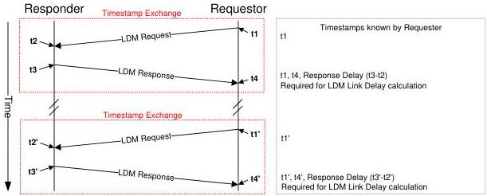

Protocol Layer

The PTM Bus Interval Counter shall be incremented when the PTM Delta Counter wraps. The PTM Bus Interval Counter is a modulus 16k counter, i.e. incrementing from 0 to 16,383, then wrapping back to 0.

The time synchronization mechanism within the device of the PTM Clock to the bus interval boundary is implementation-specific.

Hosts shall implement a set of PTM Bus Interval Boundary Counters. The host is the source of the bus interval boundary for a PTM Domain.

Hubs are not required to implement PTM Bus Interval Boundary Counters.

PTM capable devices shall implement PTM Bus Interval Boundary Counters.

### 8.4.8.2 LDM Protocol

The LDM protocol is executed with a series of Exchanges between a Requester and a Responder, and ITPs transmitted by Responders to measure the LDM Link Delay illustrates the LDM Timestamp Exchanges.

The following rules apply to LDM Requesters and Responders:

- A LDM Requester is an upstream facing port.
- A LDM Responder is a downstream facing port.
- A LDM Requester and a LDM Responder are paired on a USB link.

Figure 8-11. Link Delay Measurement Protocol

The following rules apply to LDM Requests and Responses, and LDM Requesters and Responders:

- When a LDM Requester transmits a LDM Request LMP, it uses the value of its PTM Local Time Source as the t1 timestamp. When the LDM Requester receives a LDM Response LMP it uses the value of its PTM Local Time Source as the t4 timestamp.

8-15