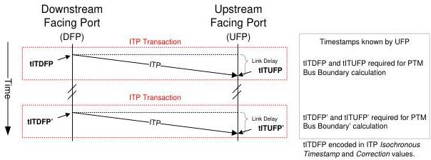

Universal Serial Bus 3.1 Specification, Revision 1.0

- When a LDM Responder receives a LDM Request LMP it uses the value of its PTM Local Time Source as the t2 timestamp, and when it transmits a LDM Response LMP it uses the value of its PTM Local Time Source as the t3 timestamp.
- Each LDM Exchange defines a set of timestamps which the LDM Requester may use to calculate the LDM Link Delay.
- If an LDM Message is received by a port that does not support PTM, then the Message shall be treated as an unsupported LMP by the port and silently dropped. Note that the port shall acknowledge the packet and return credit for the same as per the requirement specified in Section 7.2.4.1.
- LDM timestamps shall reference the first framing symbol of a received or transmitted LDM LMP.

Figure 8-12. PTM ITP Protocol

The following rules apply to ITPs and PTM capable hosts, hubs, and devices:

- The tITDFP timestamp represents the time that a PTM downstream facing port transmits an ITP.
- The tITUFP timestamp represents the time that a PTM upstream facing port receives an ITP.

### 8.4.8.2.1 LDM Timestamp Exchange

A Timestamp Exchange consists of a LDM Request LMP being generated by a LDM Requester and the LDM Responder returning a LDM Response LMP.

As illustrated in Figure 8-11, the timestamps t1, t2, t3 and t4 are created by the Requester and the Responder.

At time t4 in a Timestamp Exchange, a LDM Requester has all the information that it needs to compute the LDM Link Delay. In the example of Figure 8-11, at time t4, the Requester has recorded timestamps for t1 and t4, and received Response Delay from the Responder. Refer to Section 8.4.8.3 for how these timestamps are used to compute the LDM Link Delay.

8-16