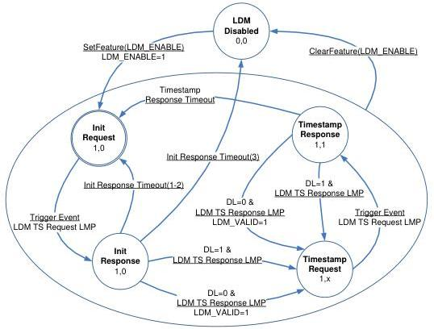

Universal Serial Bus 3.1 Specification, Revision 1.0

### 8.4.8.3.1 Requester Operation

This section describes the Timestamp Exchange operations that a Requester (Upstream Facing Port) performs to participate in the LDM protocol.

Figure 8-14. LDM Requester State Machine

The LDM Requester State Machine shall maintain the following local variable: Init Response Timeout Counter.

The LDM Requester State Machine shall maintain the following local timer: Response Timer. All local timers are set to 0 when they are “started”.

#### 8.4.8.3.1.1 Init Request

This is the initial state of the Requester after power-up, Hot Reset, or Warm Reset.

Upon entering this state, the Requester shall set the LDM Enabled flag to 1.

The Init Response Timeout Counter shall be initialized to 0 at power up, or if the Init Request state is entered from the LDM Disabled or Timestamp Response states. If the Init Request state is entered from the Init Response state, then the Init Response Timeout Counter shall not be changed.

8-18