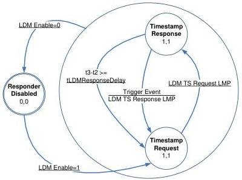

Protocol Layer

Figure 8-15. LDM Responder State Machine

The LDM Responder State Machine shall maintain the following local variable: Responder Response Delay Overflow.

### 8.4.8.3.2.1 Responder Disabled

This is the initial state of the Responder after power-up, Hot Reset, or Warm Reset.

Upon entering this state the Responder shall terminate all LDM protocol activity.

LDM Enabled=0 – If LDM Enabled equals 0, then the Responder shall transition from any other LDM state to the Responder Disabled state.

LDM Enabled=1 – If LDM Enabled equal 1, then the Responder shall transition to the Timestamp Request state.

### 8.4.8.3.2.2 Timestamp Request

Upon entering this state, the Responder shall wait for a LDM TS Request LMP.

LDM TS Request LMP – If a LDM TS Request LMP is received, the Responder shall capture timestamp t2 from the PTM Local Time Source to record the time that the LDM TS Request was received and transition to the Timestamp Response state.

Note: Timestamp t2 shall be adjusted for the TS Delay. Refer to Section 8.4.8.6 for more information.

### 8.4.8.3.2.3 Timestamp Response

Upon entering this state the Responder shall wait for a Trigger Event.

Trigger Event – When a Trigger Event occurs, the Responder shall capture timestamp t3 from the PTM Local Time Source to record the time that the LDM Response was transmitted. If the value

8-21