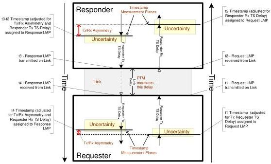

Universal Serial Bus 3.1 Specification, Revision 1.0

### 8.4.8.8 Performance

Figure 8-16 illustrates the various components of a LDM Exchange path that contribute to the overall performance of the LDM mechanism. The Requester to Responder and Responder to Requester paths apply to LDM TS Request and TS Response LMPs, respectively. The Requester Rx path applies to ITPs received by an upstream facing port and the Responder Tx path applies to ITPs transmitted by a downstream facing port.

Figure 8-16. PTM Path Performance Contributors

The following requirements should be met to achieve optimal propagation delay measurement:

- The Link Delay between Requester and Responder should be symmetric.
- Timestamp values are assigned to ITPs and TS LMPs to capture when the packet was actually received or transmitted on the Link. LDM timestamp values are also captured in ITPs (Bus Interval Counter/Delta fields) and TS Response LMPs (Response Delay) when they are transmitted.
- An implementation dependent TS Delay occurs between assigning Timestamp values to an ITP, or LDM LMP, and the packet actually being received or transmitted on the Link. Each Timestamp value should be adjusted for the respective TS Delay so that the Timestamp captured for a LDM LMP or ITP approximates the actual time that the last symbol of the respective packet crosses the boundary between a Requester or Responder and the Link.
- A port may contain asymmetric delays in its timestamp mechanism or protocol path (e.g. Rx/Tx Asymmetry). If these asymmetries are not negligible:

8-26