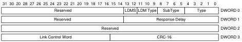

Protocol Layer

##### 8.4.8.11 Link Delay Measurement (LDM) LMP

LDM LMPs shall be used in a LDM Timestamp Exchange to measure the link delay on an upstream facing port.

Figure 8-17. LDM LMP

Table 8-11. LDM LMP

[tbl-114.md](tbl-114.md)

### 8.5 Transaction Packet (TP)

Transaction Packets (TPs) traverse the direct path between the host and a device. TPs are used to control data flow and manage the end-to-end connection. The value in the Type field shall be set to Transaction Packet. The Route String field is used by hubs to route a packet that appears on its upstream port to the correct downstream port. The route string is set to zero for a TP sent by a device. When the host sends a TP, the Device Address field contains the address of the intended recipient. When a device sends a TP to the host then it sets the Device Address field to its own address. This field is used by the host to identify the source of the TP. The SubType field in a TP is used by the recipient to determine the format and usage of the TP.

8-29