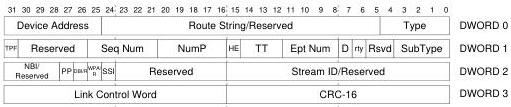

Protocol Layer

#### 8.5.1 Acknowledgement (ACK) Transaction Packet

This TP is used for two purposes:

- For IN endpoints, this TP is sent by the host to request data from a device as well as to acknowledge the previously received data packet.
- For OUT endpoints, this TP is sent by a device to acknowledge receipt of the previous data packet sent by the host, as well as to inform the host of the number of data packet buffers it has available after receipt of this packet.

Figure 8-18. ACK Transaction Packet

8-31