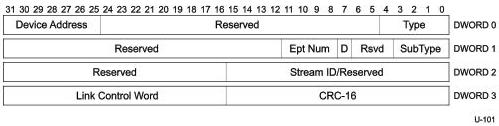
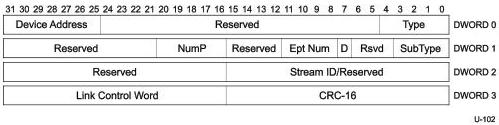

Universal Serial Bus 3.1 Specification, Revision 1.0

### 8.5.2 Not Ready (NRDY) Transaction Packet

This TP can only be sent by a device for a non-isochronous endpoint. An OUT endpoint sends this TP to the host if it has no packet buffer space available to accept the DP sent by the host. An IN endpoint sends this TP to the host if it cannot return a DP in response to an ACK TP sent by the host.

Only the fields that are different from an ACK TP are described in this section.

Figure 8-19. NRDY Transaction Packet

Table 8-14. NRDY TP Format (Differences with ACK TP)

[tbl-118.md](tbl-118.md)

### 8.5.3 Endpoint Ready (ERDY) Transaction Packet

This TP can only be sent by a device for a non-isochronous endpoint. It is used to inform the host that an endpoint is ready to send or receive data packets. Only the fields that are different from an ACK TP are described in this section.

Figure 8-20. ERDY Transaction Packet

8-34