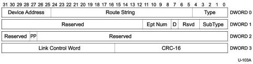

Protocol Layer

Table 8-15. ERDY TP Format (Differences with ACK TP)

[tbl-119.md](tbl-119.md)

#### 8.5.4 STATUS Transaction Packet

This TP can only be sent by the host. It is used to inform a control endpoint that the host has initiated the Status stage of a control transfer. This TP shall only be sent to a control endpoint. Only the fields that are different from an ACK TP are described in this section.

Figure 8-21. STATUS Transaction Packet

Table 8-16. STATUS TP Format (Differences with ACK TP)

[tbl-120.md](tbl-120.md)

8-35