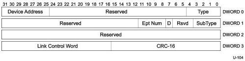
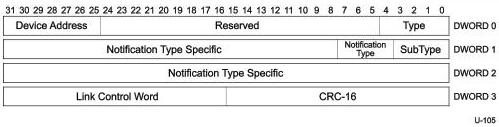

Universal Serial Bus 3.1 Specification, Revision 1.0

### 8.5.5 STALL Transaction Packet

This TP can only be sent by an endpoint on the device. It is used to inform the host that the endpoint is halted or that a control transfer is invalid. Only the fields that are different from an ACK TP are described in this section.

Figure 8-22. STALL Transaction Packet

Table 8-17. STALL TP Format (Differences with ACK TP)

[tbl-121.md](tbl-121.md)

### 8.5.6 Device Notification (DEV_NOTIFICATION) Transaction Packet

This TP can only be sent by a device. It is used by devices to inform the host of an asynchronous change in a device or interface state, e.g., to identify the function within a device that caused the device to perform a remote wake operation. This TP is not sent from a particular endpoint but from the device in general. Only the fields that are different from an ACK TP are described in this section.

Figure 8-23. Device Notification Transaction Packet

8-36