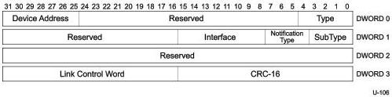

Protocol Layer

Table 8-18. Device Notification TP Format (Differences with ACK TP)

[tbl-122.md](tbl-122.md)

### 8.5.6.1 Function Wake Device Notification

Figure 8-24. Function Wake Device Notification

Table 8-19. Function Wake Device Notification

[tbl-123.md](tbl-123.md)

$^{1}$ This Notification Type value shall be reserved for OTG use. Refer to Section 5.5 of the USB 3.0 OTG and EH Supplement for the definition of the respective Device Notification TP.

$^{2}$ This Device Notification is required for devices not operating at Gen 1 Speed. This Device Notification is optional for devices operating at Gen 1 speed.

8-37