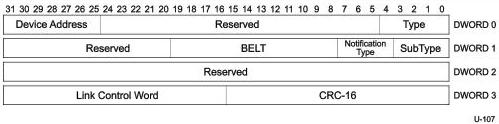

Universal Serial Bus 3.1 Specification, Revision 1.0

### 8.5.6.2 Latency Tolerance Message (LTM) Device Notification

Latency Tolerance Message Device Notification is an optional normative feature enabling more power efficient platform operation.

Figure 8-25. Latency Tolerance Message Device Notification

Table 8-20. Latency Tolerance Message Device Notification

[tbl-124.md](tbl-124.md)

8-38