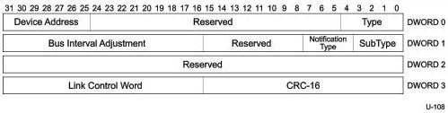

Protocol Layer

### 8.5.6.3 Bus Interval Adjustment Message Device Notification

The Bus Interval Adjustment Message Device Notification is only defined for devices operating at Gen 1 speed.

Figure 8-26. Bus Interval Adjustment Message Device Notification

Table 8-21. Bus Interval Adjustment Message Device Notification

[tbl-125.md](tbl-125.md)

### 8.5.6.4 Function Wake Notification

A function may signal that it wants to exit from device suspend (after transitioning the link to U0) or function suspend by sending a Function Wake Device Notification to the host if it is enabled for remote wakeup. Refer to Section 9.2.5 for more details.

### 8.5.6.5 Latency Tolerance Messaging

Latency Tolerance Messaging is an optional normative USB power management feature that utilizes reported BELT (Best Effort Latency Tolerance) values to enable more power efficient platform operation.

The BELT value is the maximum time (factoring in the service needs of all configured endpoints) for leaving a device without service from the host. Specifically, the BELT value is the time between the host's receipt of an ERDY from a device, and the host's transmission of the response to the ERDY.

Devices indicate whether they are capable of sending LTM TPs using the LTM Capable field in the SUPERSPEED_USB Device Capability descriptor in the BOS descriptor (refer to Section 9.6.2). The LTM Enable (refer to Section 9.4.10) feature selector enables (or disables) an LTM capable device to send LTM TPs.

8-39