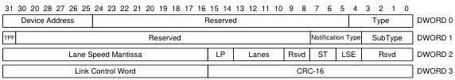

Universal Serial Bus 3.1 Specification, Revision 1.0

### 8.5.6.7 Sublink Speed Device Notification

Sublink Speed Device Notification TPs are reported by the device to identify the characteristics of its link connection. Sublink Speed Device Notification TPs shall be generated by Enhanced SuperSpeed devices not operating at Gen 1 speed upon entering the Address USB Device State.

Lane Speed = Lane Speed Mantissa * 1000$^{Lane Speed Exponent}$

Sublink Speed = Lane Speed * (Lane Count + 1)

- The device shall inform the host that a Device Notification TP shall follow a SET_ADDRESS request by setting the TP Follows (TPF) flag in the Status stage ACK TP.
- The Rx Sublink Speed Device Notification TP shall be the next TP transmitted by a device after setting the TP Follows (TPF) flag in a Status stage ACK TP.
- The device shall inform the host that a second Device Notification TP shall follow the Rx Sublink Speed Device Notification TP by setting the TP Follows (TPF) flag in the Rx Sublink Speed Device Notification TP.
- The Tx Sublink Speed Device Notification TP shall be the next TP transmitted by a device after setting the TP Follows (TPF) flag in the Rx Sublink Speed Device Notification TP.

Asymmetric Lane Types may only be reported by SuperSpeed Interchip (SSIC) devices. A Symmetric link is one that has the same Lane Speed and number of lanes for both the Rx and Tx Sublinks. Enhanced SuperSpeed devices shall only support Symmetric links and shall only support one lane per sublink.

U-108A

Figure 8-27. Sublink Speed Device Notification

Table 8-22. Sublink Speed Device Notification

[tbl-126.md](tbl-126.md)

8-42