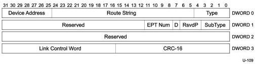

Universal Serial Bus 3.1 Specification, Revision 1.0

### 8.5.7 PING Transaction Packet

This TP can only be sent by the host. It is used by the host to transition all links in the path to a device back to U0 prior to initiating an isochronous transfer. Refer to Appendix C for details on the usage of this TP. Only the fields that are different from an ACK TP are described in this section.

A device shall respond to the PING TP by sending a PING_RESPONSE TP (refer to Section 8.5.8) to the host within the tPingResponse time (refer to Table 8-36). Note that the device shall not validate the EP_NUM and Direction fields and simply copy them to the respective fields in the PING_RESPONSE TP.

A device shall keep its link in U0 until it receives a subsequent packet from the host, or until the tPingTimeout time (refer to Table 8-36) elapses.

Figure 8-28. PING Transaction Packet

Table 8-23. PING TP Format (differences with ACK TP)

[tbl-128.md](tbl-128.md)

### 8.5.8 PING_RESPONSE Transaction Packet

This TP can only be sent by a device in response to a PING TP sent by the host. A PING_RESPONSE TP shall be sent for each PING TP received. Refer to Appendix C for details on the usage of this TP. Only the fields that are different from an ACK TP are described in this section.

8-44