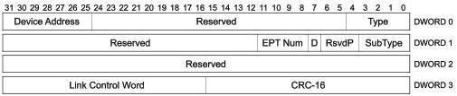

Protocol Layer

U-110

Figure 8-29. PING_RESPONSE Transaction Packet

Table 8-24. PING_RESPONSE TP Format (Differences with ACK TP)

[tbl-129.md](tbl-129.md)

### 8.6 Data Packet (DP)

This packet can be sent by either the host or a device. The host uses this packet to send data to a device. Devices use this packet to return data to the host in response to an ACK TP. All data packets are comprised of a Data Packet Header and a Data Packet Payload. Only the fields that are different from an ACK TP are described in this section.

Data packets traverse the direct path between the host and a device. Note that it is permissible to send a data packet with a zero length data block; however, it shall have a CRC-32.

8-45