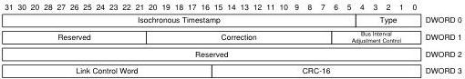

Protocol Layer

## 8.7 Isochronous Timestamp Packet (ITP)

The Isochronous Timestamp Packet (ITP) shall be multicast on all links in U0 that have completed Port Configuration.

The value in the Type field is Isochronous Timestamp Packet for an ITP. ITPs are used to deliver timestamps from the host to all active devices. ITPs carry no addressing or routing information and are multicast by hubs to all of their downstream ports with links in the U0 state and that have completed Port Configuration. A device shall not respond to an ITP. ITPs are used to provide host timing information to devices for synchronization. Note that any device or hub may receive an ITP. The host shall transmit an ITP on a root port link if and only if the link is already in U0. Only the host shall initiate an ITP transmission. The host shall not bring a root port link to U0 for the purpose of transmitting an ITP. The host shall transmit an ITP in every bus interval within tTimestampWindow from a bus interval boundary if the root port link is in U0. The host shall begin transmitting ITPs within tIsochronousTimestampStart from when the host root port's link enters U0 from the polling state. An ITP may be transmitted in between packets in a burst. If a device receives an ITP with the delayed flag (DL) set in the link control word, the timestamp value may be significantly inaccurate and may be ignored by the device.

Figure 8-31. Isochronous Timestamp Packet

8-49