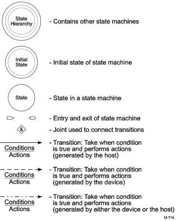

Universal Serial Bus 3.1 Specification, Revision 1.0

Figure 8-35. Legend for State Machines

### 8.12.1.2 Bulk IN Transactions

When the host is ready to receive bulk data, it sends an ACK TP to a device indicating the sequence number and number of packets it expects from the device. A Bulk endpoint shall respond as defined in Section 8.11.1.

The host shall send an ACK TP for each valid DP it receives from a device. A device does not need to wait for the ACK TP to send the next DP to the host if the previous ACK TP indicated that the host expected the device to send more than one DP (depending on the value of the Number of Packets field in the TP). The ACK TP implicitly acknowledges the last DP with the previous sequence number as being successfully received by the host and also indicates to the device the next DP with the sequence number and number of packets the host expects from the device. If the host detects an error while receiving any of the DPs, it shall send an ACK TP with the sequence number value set to the first DP that was received with an error with the Retry bit set, even if subsequent packets in the burst asked for by the host were received without error. A device is required to resend all DPs starting from the sequence number set in the ACK TP in which the Retry bit set.

8-62