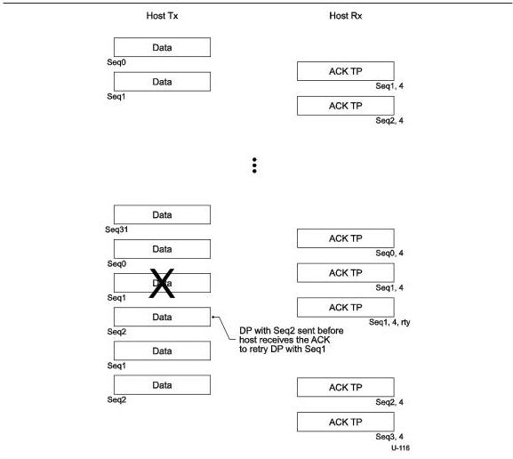

Protocol Layer

Figure 8-37. Sample BULK OUT Sequence

### 8.12.1.4 Bulk Streaming Protocol

The Stream Protocol adheres to the semantics of the standard Enhanced SuperSpeed Bulk protocol, so the packet exchanges on an Enhanced SuperSpeed bulk pipe that supports Streams are indistinguishable from an Enhanced SuperSpeed bulk pipe that does not. The Stream Protocol is managed strictly through manipulation of the Stream ID field in the packet header.

Note: Device Class defined methods are used for coordinating the Stream IDs that are used by the host to select Endpoint Buffers and by the device to select the Function Data associated with a particular Stream. Typically this is done via an out-of-band mechanism (e.g., another endpoint) that is used to pass the list of "Active Stream IDs" between the host and the device.

Note: The Stream state machines illustrate a 1:1 relationship between sending a DP and receiving an ACK. Logically this is true; however, Enhanced SuperSpeed burst capabilities allows up to MaxBurst outstanding ACKs between the host and a device so temporally there may be a "many to

8-65