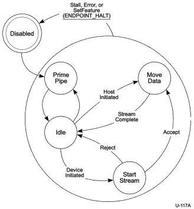

Universal Serial Bus 3.1 Specification, Revision 1.0

1" relationship. Bursts are managed on a Stream pipe identically to how they are managed on a normal Bulk pipe. Refer to Section 8.10.2 for more information on Burst Transactions.

Note: As described in this section, the Stream Protocol applies to the state of the “pipe” and is described as single entity. In reality, the Stream Protocol is being tracked independently by the host at one end of the pipe and the device at the other. So at any instant in time the two ends may momentarily be out of phase due to packet propagation delays between the host and the device.

Note: If a Retry is requested and the host cannot continue retransmission of a DP during the current burst, the host shall return to the endpoint at the next available opportunity within the constraints of the transfer type.

Figure 8-38. General Stream Protocol State Machine (SPSM)

Figure 8-38 illustrates the basic state transitions of the Stream Protocol State Machine (SPSM). This section describes the general transitions of the SPSM as they apply to both IN and OUT endpoints. Detailed operation of the SPSM for IN and OUT endpoints is described in subsequent sections.

Disabled – This is the initial state of the pipe after it is configured, as well as the state that is transitioned to if an error is detected in any of the other states. The first time an Endpoint Buffer is assigned to the pipe, the host shall transition the SPSM to the Prime Pipe state. If the Disabled state was entered due to an error, then the error condition must be removed by software intervention before the state may be exited.

Note that an error (e.g., Stall) or a SetFeature(ENDPOINT_HALT) request shall transition any SPSM state to the Disabled state. If an error condition is detected by the host (e.g., Stall,

8-66