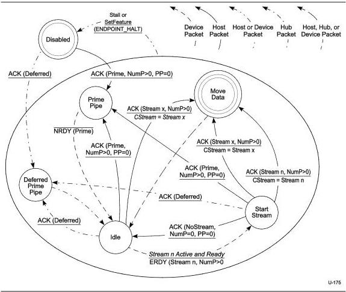

Universal Serial Bus 3.1 Specification, Revision 1.0

Figure 8-39. Device IN Stream Protocol State Machine (DISPSM)

### 8.12.1.4.2.1 Disabled

After an endpoint is configured or receives a SetFeature(ENDPOINT_HALT) request, the pipe is in the Disabled state.

ACK(Prime, NumP>0, PP=0) - If an ACK TP with the Stream ID field set to Prime is received, then the device shall transition the pipe to the Prime Pipe state. This transition occurs after the initial Endpoint Buffers are assigned to the pipe by system software.

ACK(Deferred) - If an ACK with the Deferred (DF) flag set is received, then the device shall transition the pipe to the Deferred Prime Pipe state. This packet is received when the link has transitioned to a U1 or U2 state while waiting for the initial Endpoint Buffer assignment.

### 8.12.1.4.2.2 Prime Pipe

The Prime Pipe state informs the device that the Endpoint Buffers have been assigned to one or more Streams; however, it does not specify which Stream(s). In this state, the device shall set all Active Streams to Ready. After returning to the Idle state the device shall issue an ERDY to start a specific Stream from its list of Active Streams.

8-70