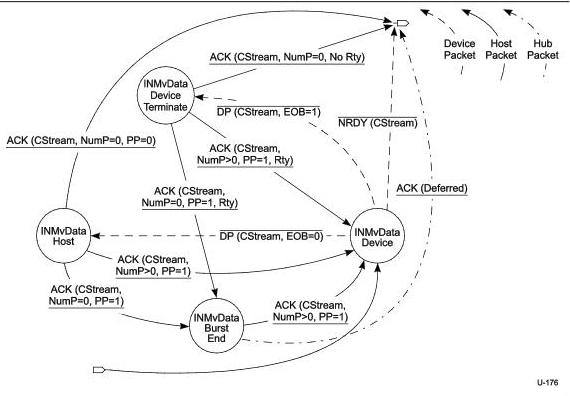

Protocol Layer

### 8.12.1.4.2.6 Move Data

In the Device IN Move Data state, CStream is set to the same value at both ends of the pipe and the pipe may actively move data. The details of the bus transactions executed in the Move Data state and its exit conditions are defined in the Device IN Move Data State Machine defined below.

Figure 8-40. Device IN Move Data State Machine (DIMDSM)

The Device IN Move Data State Machine (DIMDSM) is entered from the Start Stream or Idle states as described above. The entry into the DIMDSM immediately transitions to the INMvData Device state. The DIMDSM allows either the device to terminate the Move Data operation because it has exhausted its Function Data associated with a Stream or the host to terminate the Move Data operation because it has exhausted its Endpoint Buffer space associated with a Stream.

The DIMDSM always exits to the Idle state. The Retry (Rty=1) flag shall never be set in a packet that causes a DIMDSM exit. A Stream pipe remains in the Move Data state during packet retries.

Note: The Stream ID value shall be CStream for all packets exchanged in the Move Data state. If a Stream ID value other than CStream is detected while in the DIMDSM, the device should halt the endpoint.

Note: if CStream is not Active upon initially entering the Move Data state, the device may reject the Stream proposal with an NRDY or STALL the pipe, as defined by the associated Device Class.

8-73