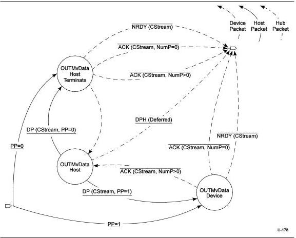

Protocol Layer

### 8.12.1.4.3.6 Start Stream End

In the **Start Stream End** state, the device has received a rejection of the Stream selection that it has proposed, and must respond to the DP from the host. The Bulk protocol requires an ACK or NRDY response for any DP sent. The Streams protocol specifies that an NRDY is sent.

NRDY(NoStream) - The device shall generate an NRDY with the Stream ID equal to *NoStream* and transition to the **Idle** state.

### 8.12.1.4.3.7 Move Data

In the Device OUT **Move Data** state, *CStream* is set to the same value at both ends of the pipe and the pipe may actively move data. The details of the bus transactions executed in the **Move Data** state and its exit conditions are defined in the Device OUT Move Data State Machine defined below.

Figure 8-42. Device OUT Move Data State Machine (DOMDSM)

The Device OUT Move Data State Machine (DOMDSM) is entered from the **Start Stream** or **Idle** states as described above.

8-79