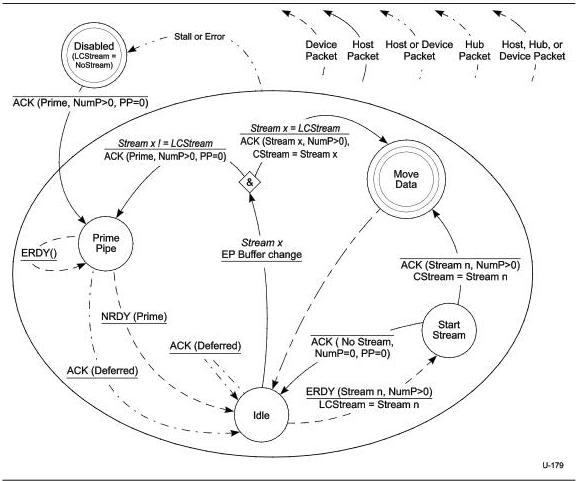

Universal Serial Bus 3.1 Specification, Revision 1.0

Figure 8-43. Host IN Stream Protocol State Machine (HISPSM)

### 8.12.1.4.4.1 Disabled

After an endpoint is configured or an endpoint error condition (Stall, tHostTransactionTimeout, etc.) request, the pipe is in the **Disabled** state and *LCStream* is initialized to *NoStream*.

ACK(Prime, NumP>0, PP=0) - When the initial Endpoint Buffers are assigned to the pipe by system software, the host shall send an ACK TP with the Stream ID field set to *Prime* to the device, and transition the pipe to the **Prime Pipe** state.

### 8.12.1.4.4.2 Prime Pipe

The **Prime Pipe** state informs the device that the Endpoint Buffers have been assigned to one or more Streams.

NRDY(Prime) – If the host receives an NRDY TP with its Stream ID field set to *Prime*, it shall transition to the **Idle** state. This transition is the normal termination of a Prime Pipe operation.

ACK(Deferred) - If an ACK with the Deferred (DF) flag set is received, then the host shall transition the pipe to the **Idle** state. This packet may be received when the link has transitioned to a

8-82